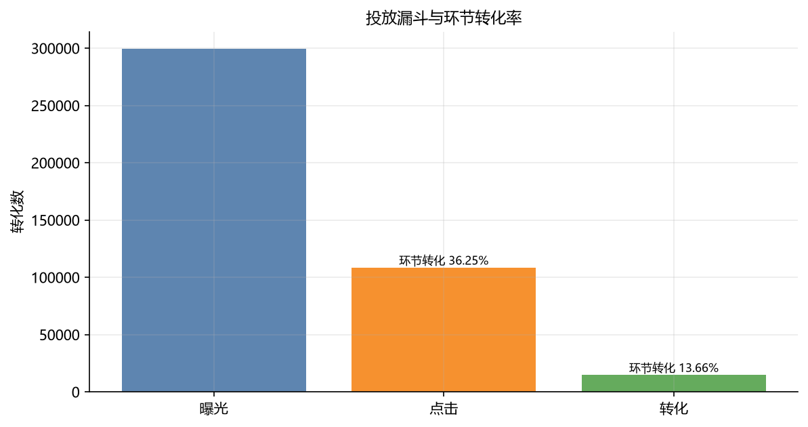
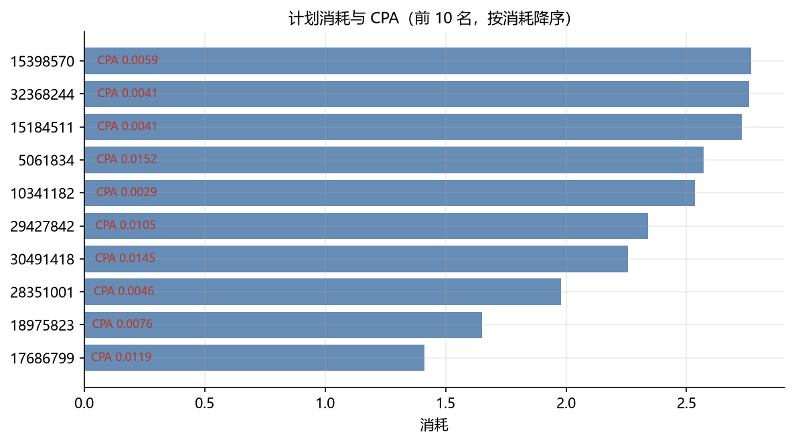
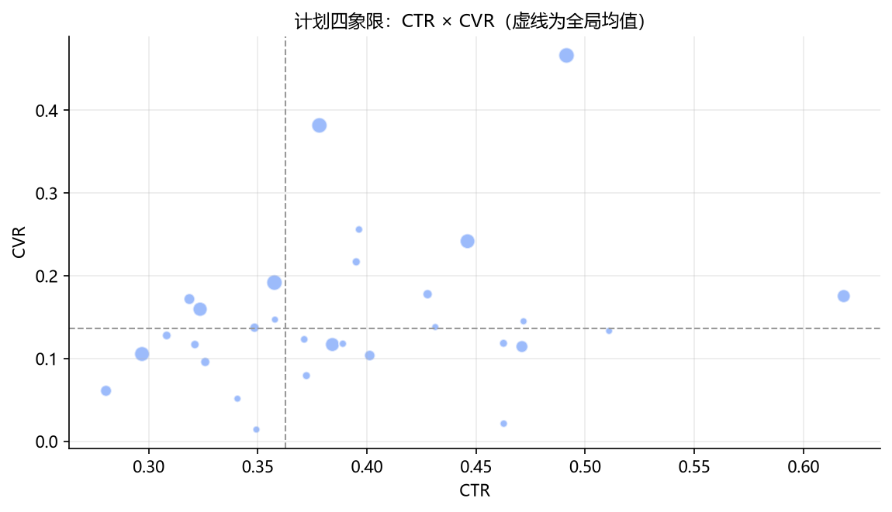
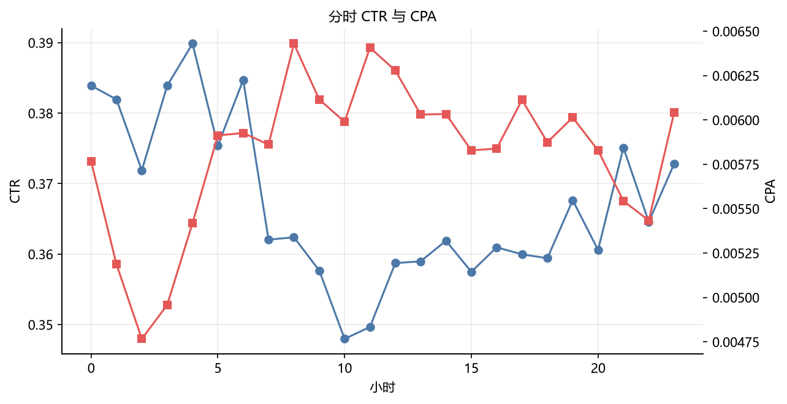
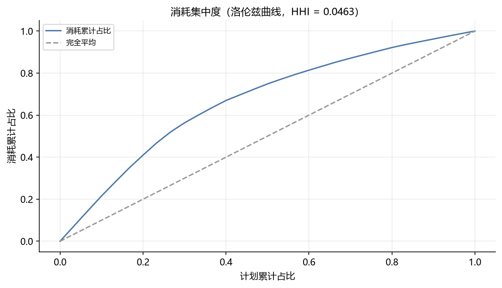
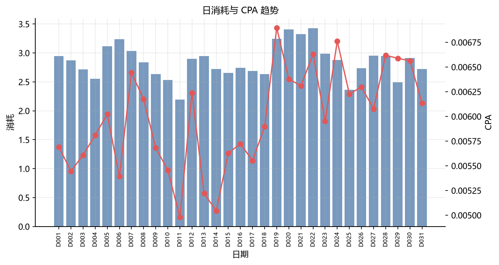

<div align="center">


[](https://github.com/lss680455-create/adops-diagnostics/actions/workflows/ci.yml)


[功能](#功能) · [快速开始](#快速开始) · [报告长什么样](#报告长什么样) · [架构](#架构) · [口径与规则](#口径与规则) · [数据](#数据) · [设计取舍](#设计取舍)

</div>

---

## 这是什么

**adops-diagnostics** 是一条把「广告投放复盘」工程化的流水线：
给它一份投放后台导出（或仓库自带的离线夹具），它输出一份**可以直接发出去的诊断报告**——
哪些计划在拖后腿、哪一层转化断了、钱该往哪挪、下一轮实验怎么设计，每条结论都带着
证据、动作与影响面。

三条纪律：

- **可复算**：报告里的每个数字都能从 `outputs/` 下的中间产物逐层推回去；
- **确定性**：同一份数据两次运行，报告除生成时间外逐字节一致，可以 diff；
- **零密钥**：没有 API key、没有外网，全流程照常跑通。

一句话概括设计取舍：**决策交给规则，表达交给 AI**。

## 功能

- 🔀 **九阶段流水线** — 取数 → 清洗 → 体检 → 指标 → 诊断 → 图表 → 调仓 → 实验 → 成稿，
  每阶段独立可测、产物落盘。 → [`adops/pipeline.py`](adops/pipeline.py)
- 🧩 **两种输入布局自适应** — 曝光级日志与聚合报表（含中文列名）走同一套口径，
  出口同构。 → [`adops/clean/normalize.py`](adops/clean/normalize.py)
- 🩺 **数据质量体检 12 项** — 完整率 / 重复率 / 逻辑一致性 / 消耗异常 / 时间覆盖 /
  归因覆盖率，输出 `ok` `warn` `fail` 与阈值依据；清洗层的每次修正都留痕。
  → [`adops/clean/quality.py`](adops/clean/quality.py)
- 🎯 **12 条确定性诊断规则** — 全部带样本量门槛，比率类问题额外做显著性检验，
  时段机会做 Bonferroni 校正。 → [`docs/DIAGNOSIS-RULES.md`](docs/DIAGNOSIS-RULES.md)
- 🧮 **零依赖统计层** — 两比例 z 检验、Wilson 区间、样本量/MDE/功效互算、
  O'Brien-Fleming 序贯边界，只用标准库，公式写在代码里。
  → [`adops/experiment/tests_stats.py`](adops/experiment/tests_stats.py)
- 💰 **预算再分配模拟** — 确定性算法输出「先试哪个方向」，并把一阶近似的假设
  随结果一起打印。 → [`adops/metrics/allocation.py`](adops/metrics/allocation.py)
- 🤖 **AI 叙述层 + 数字回指守卫** — 结论由规则产出，AI 只负责表达；模型输出里
  每个数字都必须能在证据表里匹配到，否则整段作废、回落到确定性模板。
  → [`adops/ai/`](adops/ai)
- 🧾 **复核用 SQL** — 6 段与结论口径完全一致的查询，方便业务方在数仓里自己核一遍。
  → [`adops/compose/sql.py`](adops/compose/sql.py)
- 📊 **6 张标准图** — 计划「消耗 × CPA」、CTR×CVR 象限、漏斗、分时双轴、洛伦兹曲线、
  日趋势；无中文字体时自动降级为英文标签。 → [`adops/charts/report_charts.py`](adops/charts/report_charts.py)

## 快速开始

```bash
git clone https://github.com/lss680455-create/adops-diagnostics.git
cd adops-diagnostics
pip install -e ".[charts,dev]"

# 用仓库自带的离线夹具跑一遍（真实公开数据，零网络零密钥）
python -m adops run --source sample --out outputs/demo
```

打开 `outputs/demo/report.md` 与 `outputs/demo/figures/`。

换成自己的数据（投放后台导出的 CSV/TSV，列名会自动识别，中英文都认）：

```bash
python -m adops run --source csv --data-file 我的导出.csv --out outputs/本周
```

单点使用：

```bash
python -m adops quality   --source sample          # 只做数据体检
python -m adops diagnose  --source sample          # 只看诊断发现
python -m adops design --baseline 0.01 --daily 50000 --mde-rel 0.1   # 算样本量
python -m adops evaluate --control 100 10000 --variant 150 10000     # 判定已有实验
python -m adops billing --ctr 0.02 --cpc 0.5 --cvr 0.05 --target-cpa 10  # 计费口径换算
python -m adops sql --name 计划效率                 # 输出复核用 SQL
```

## 报告长什么样

```markdown
## 0. 结论摘要
本次共发现 4 项问题，其中高优先级 1 项……

## 5. 诊断发现（按优先级排序）
### R02　[高] 归因覆盖率不足，CPA 被系统性高估
- **对象**：归因回传链路
- **影响消耗占比**：100.00%　**优先级分**：3.0000
- **证据**：
  - 归因转化 8,099 / 全部转化 14,823 = 54.64%
  - 门店阈值 80.00%，当前低于阈值 25.36%
- **建议动作**：核对转化回传埋点、归因窗口与去重规则……
- **影响说明**：归因缺失会让所有渠道的 CPA 横向对比失真，容易误砍真实有效的计划
```

完整示例结构见 [`docs/PRODUCT.md`](docs/PRODUCT.md) 的「一条命令的输入输出」一节。
报告固定九节，**每一节回答一个真实会被问到的问题**——这是它与「AI 写一段总结」的核心差别。

成品报告与全部图表见 [`examples/sample_report/`](examples/sample_report/)（用仓库自带夹具跑出来的，
不装依赖也能先看交付物）。

| 投放漏斗与环节转化 | 计划「消耗 × CPA」 |
|---|---|
|  |  |

| 计划 CTR×CVR 象限 | 分时 CTR 与 CPA |
|---|---|
|  |  |

| 消耗集中度（洛伦兹曲线） | 日消耗与 CPA 趋势 |
|---|---|
|  |  |

## 架构

```
取数 → 清洗 → 体检 → 指标 → 诊断 → 图表 → 调仓 → 实验 → 成稿
collect  clean  quality  metrics  diagnose  charts  allocation  experiment  compose
```

| 层 | 目录 | 要点 |
|---|---|---|
| 取数 | `adops/collect/` | 列名别名映射（巨量/腾讯/手工表中英文常见写法）、布局识别 |
| 清洗 | `adops/clean/` | 统一计数表、时间口径归一化、去重与钳位（修正留痕） |
| 指标 | `adops/metrics/` | 纯函数指标 + 聚合（**先加总再相除**）+ 调仓 |
| 诊断 | `adops/diagnose/` | 12 条规则 + 确定性优先级排序 |
| 统计 | `adops/experiment/` | 零依赖检验与实验设计 |
| AI | `adops/ai/` | 叙述层 + 数字回指守卫 |
| 成稿 | `adops/compose/` | Markdown 报告 + 复核 SQL |

细节见 [`docs/ARCHITECTURE.md`](docs/ARCHITECTURE.md)。

## 口径与规则

- [指标口径（METRICS）](docs/METRICS.md)：全部公式、计费口径换算（CPM/CPC/CPA/oCPC）、
  统计方法（合并方差 vs 非合并方差、Wilson 区间、序贯边界、多重比较）。
- [诊断规则库（DIAGNOSIS-RULES）](docs/DIAGNOSIS-RULES.md)：12 条规则的触发条件、
  样本量门槛、阈值理由、建议动作，以及**「不报的情形」**（同等重要）。
- 一条恒等式自检：`CPM ≡ CPA × CVR × CTR × 1000`。它在数学上必然成立，
  所以它检验的不是数据对错，而是报表口径有没有被动过。

## 数据

仓库自带的离线夹具来自 **Criteo Attribution Modeling for Bidding Dataset**
（公开研究数据集，16,468,027 次真实曝光，CC BY-NC-SA 4.0），由
[`scripts/build_fixture.py`](scripts/build_fixture.py) 可复现地生成：

| 夹具 | 内容 | 演示的链路 |
|---|---|---|
| `criteo_impression_sample.csv.gz` | 299,418 条曝光级日志 | 曝光级 → 清洗 → 体检 → 指标 |
| `criteo_campaign_hourly_sample.csv` | 36,982 行「计划 × 天 × 小时」中文报表 | 聚合报表 + 中文列名别名 |

> ⚠️ **数据边界**：该数据集经过抽样与脱敏，CTR / CPM / CPA 的**绝对数值不代表任何行业
> 真实水平**；其 `cost` 字段是数据集作者说明的「变换后的价格」，不是货币；
> 时间戳是相对秒数，报告如实标为 `relative_day`。
> 本仓库用它验证的是口径、流程与诊断逻辑。换成自己的导出，结论立刻可用于决策。

为什么不用合成假数据：合成数据可以随便调好看，但无法暴露真实数据的坑。这个项目里有两处
规则是被真实数据推翻后重写的（见 [`CHANGELOG.md`](CHANGELOG.md) 与
[`docs/PRODUCT.md`](docs/PRODUCT.md) 的迭代记录）。

## 设计取舍

### 为什么用规则做诊断，而不是让模型直接判断

| 维度 | 规则 | 模型直接判断 |
|---|---|---|
| 可复算 | 同输入同输出 | 每次侧重都不同 |
| 可反驳 | 能指出「你的门槛是 30 次点击，我的计划只有 28 次」 | 只能反驳「我觉得」 |
| 可回归 | 改一条阈值能看到哪些结论变了 | 无法 diff |

所以：**AI 提升的是可读性与交付速度，不是替你决定砍哪个计划。**

### 为什么给 AI 输出加「数字回指守卫」

模型最危险的失败不是写得差，而是**写出一个报表里没有的数**——运营照着这个数砍预算，
事后没人能复现。所以把纪律做成代码：输出里的每个数字要么能匹配到证据表（容差 5%，
容忍四舍五入），要么整段作废、回落到确定性模板。这条守卫在 CI 里是一条会失败的检查
（[`scripts/check_narrative.py`](scripts/check_narrative.py)）。

### 为什么所有阈值都要求样本量达标才报警

**漏报一次机会的成本，远小于让运营对报表失去信任。** 所以转化数不到 10 的计划不做
效率判定、曝光不到 1 000 的不做 CTR 判定、3 个计划时不算 HHI、时段机会做 Bonferroni 校正。

### 为什么统计层不用 scipy

只需要两比例检验与正态分位数，标准库的 `statistics.NormalDist` 与 `math.erf` 足够。
自己实现能把公式写在代码里、结论可逐行复核，也不会随库版本漂移数值口径。

## 测试

```bash
python -m pytest -q          # 191 项，全部离线、零密钥、不读仓库外文件
```

覆盖重点：

- **口径纪律**：`SUM 后相除 ≠ 行级比率平均`（构造数据上两者差 17 倍）；
- **统计已知值**：z 检验、Wilson 区间、样本量闭式解、序贯边界都用已知结果钉住；
- **规则该报与该不报**：样本量门槛、显著性、多重比较校正都有反例测试；
- **AI 守卫**：模型编数字必须被拦下并回落；调用失败必须降级；
- **流水线确定性**：两次运行逐字节一致，中间产物可逐层复算。

CI 在 Python 3.9 / 3.11 / 3.12 上跑通，并额外断言「结论中无不可回指的数字」
与「报告保留数据边界声明」。

## 文档导航

| 文档 | 内容 |
|---|---|
| [`docs/PRODUCT.md`](docs/PRODUCT.md) | 产品视角：用户与场景、九节报告对应的九个问题、设计决策理由、验收标准、迭代记录、明确的未做清单 |
| [`docs/ARCHITECTURE.md`](docs/ARCHITECTURE.md) | 九阶段、数据契约、清洗层两处关键判定、AI 层三条硬约束、依赖取舍、已知边界 |
| [`docs/METRICS.md`](docs/METRICS.md) | 指标口径、计费换算恒等式、结构指标、统计口径 |
| [`docs/DIAGNOSIS-RULES.md`](docs/DIAGNOSIS-RULES.md) | 12 条规则逐条说明与「不报的情形」 |
| [`examples/`](examples/) | 夹具说明与产出物清单 |
| [`CHANGELOG.md`](CHANGELOG.md) | 版本记录（含被真实数据推翻的两处设计） |

## 许可

代码 MIT。仓库自带的离线夹具来自 Criteo 公开数据集（**CC BY-NC-SA 4.0，非商用**），
版权归原作者；详见 [`examples/sample_data/README.md`](examples/sample_data/README.md)。
